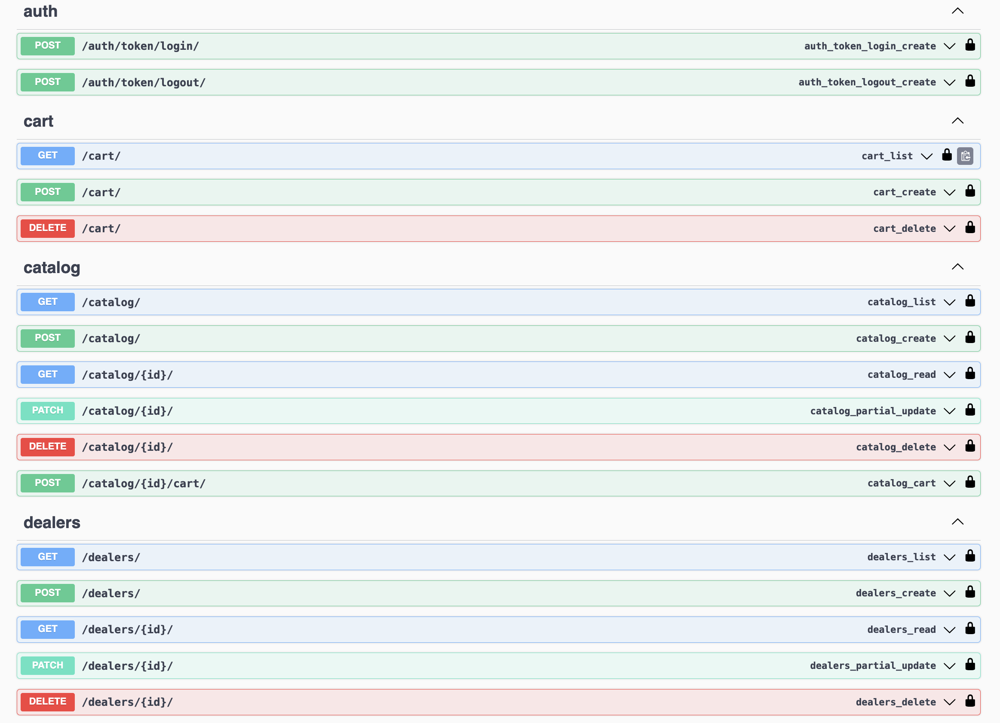
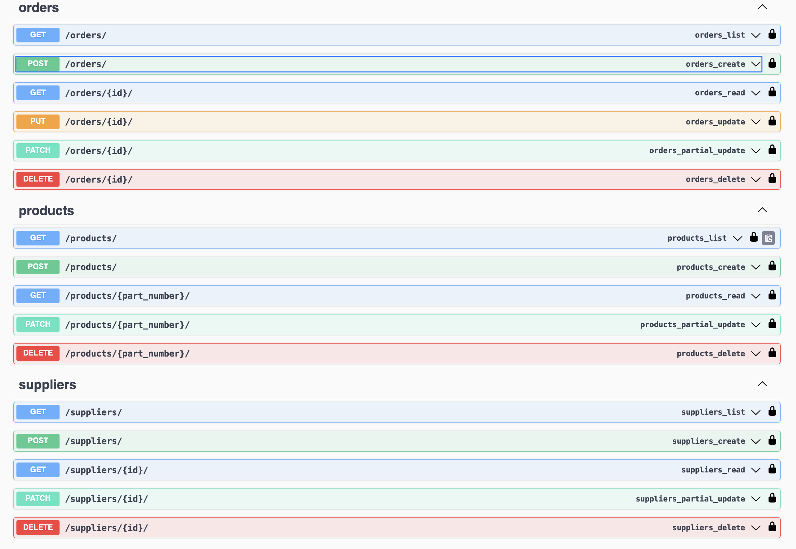
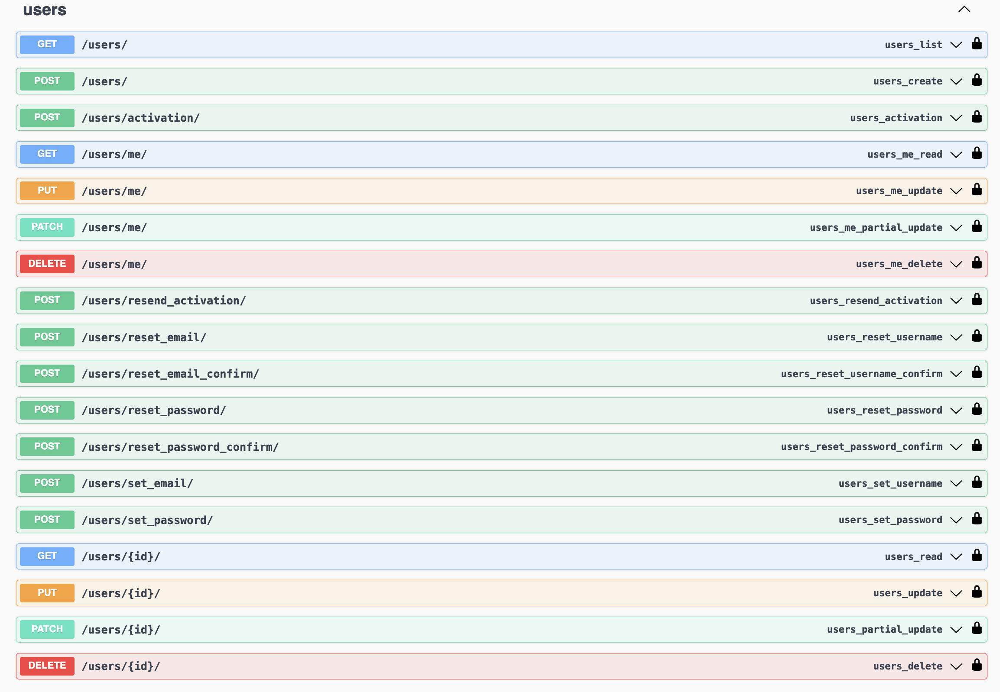

# OIL ORDERS DNM (в разработке)

Ресурс OIL ORDERS DNM позволяет дилерам размещать заказы на масла и технологические жидкости

## Ресурсы API OIL ORDERS DNM (в разработке)

* Ресурс **auth**: аутентификация.
* Ресурс **users**: пользователи.
* Ресурс **suppliers**: поставщики
* Ресурс **dealers**: дилеры
* Ресурс **catalog**: каталог продукции
* Ресурс **products**: товары поставщиков
* Ресурс **cart**: корзина заказов
* Ресурс **orders**: заказы

### Документация для проекта OIL DNM:

Ссылка на swagger:

<http://127.0.0.1:8000/swagger/>

## Стек технологий

